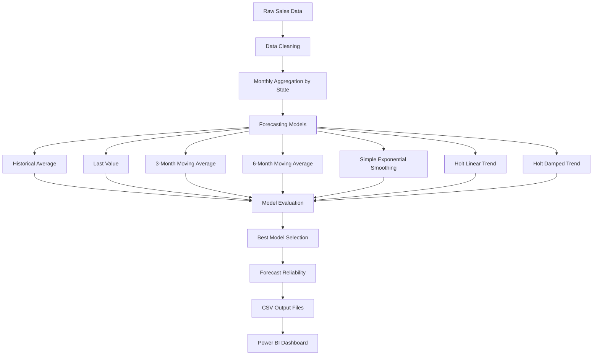

# Enterprise Sales Forecasting

A Python-based sales forecasting project that predicts future sales using historical sales data. The project benchmarks multiple time-series forecasting models, evaluates their performance using forecasting accuracy metrics, and automatically selects the best-performing model for each state.

---

# Overview

This project demonstrates an end-to-end sales forecasting workflow built using Python and a publicly available retail sales dataset.

The objective is to build an automated forecasting pipeline that transforms raw sales transactions into reliable monthly forecasts using historical sales patterns.

Unlike many forecasting projects that rely on a single model, this project compares several forecasting techniques for every state and automatically selects the model with the lowest forecasting error.

> **Note:** This project uses only publicly available data. No confidential company data, reports, SAP objects, SQL queries, or proprietary business information are included.

---

# Business Problem

Businesses operating across multiple locations need reliable sales forecasts for planning production, inventory, procurement and sales activities.

Many organizations still prepare forecasts manually using spreadsheets or assumptions, making the forecasting process inconsistent across locations.

This project automates that process by:

- Cleaning historical sales data
- Aggregating monthly sales
- Comparing multiple forecasting models
- Selecting the most accurate model automatically
- Classifying forecast reliability
- Producing dashboard-ready outputs

The forecasts in this project are generated **only from historical sales data**. External factors such as market trends, promotions, holidays, competitor activity or economic indicators are **not included** in the forecasting models.

---

# Project Workflow



---

# Forecasting Models

The forecasting engine evaluates seven different forecasting approaches.

- Historical Average
- Last Value
- 3-Month Moving Average
- 6-Month Moving Average
- Simple Exponential Smoothing
- Holt Linear Trend
- Holt Damped Trend

Each state is evaluated independently because sales behaviour differs across locations.

Rather than assuming one model performs best everywhere, the pipeline selects the model that produces the lowest forecasting error for each state.

---

# Evaluation Metrics

Every forecasting model is evaluated using four different metrics.

| Metric | Purpose |
|---------|----------|
| MAE | Measures average forecasting error |
| RMSE | Gives greater importance to larger forecasting errors |
| MAPE | Measures forecasting error as a percentage |
| WAPE | Used to select the best forecasting model |

All four metrics are reported to compare model performance.

**WAPE is used as the final model-selection metric** because it provides a stable comparison across states with different sales volumes.

---

# Forecast Reliability

Once the best model is selected, forecasting reliability is classified using WAPE.

| WAPE | Reliability |
|-------|-------------|
| <10% | High |
| 10–20% | Moderate |
| 20–30% | Low |
| >30% | Very Low |

This provides a simple indication of how reliable each forecast is.

---

# Dataset

This project uses the **Superstore Sales Dataset** available on Kaggle.

Fields used:

- Order Date
- Sales
- State
- Region
- Category

The dataset is used only for demonstrating the forecasting methodology with public data.

---

# Technologies

- Python
- Pandas
- NumPy
- Statsmodels
- Scikit-learn
- Matplotlib
- Power BI
- Git
- GitHub

---

# Repository Structure

```
enterprise-sales-forecasting
│
├── README.md
├── requirements.txt
│
├── data/
│   ├── train.csv
│   └── README.md
│
├── src/
│   ├── preprocessing.py
│   ├── forecasting.py
│   ├── evaluation.py
│   └── main.py
│
├── notebooks/
│   └── Sales_Forecasting.ipynb
│
├── output/
│   ├── forecast_results.csv
│   ├── best_model.csv
│   ├── reliability_table.csv
│   ├── model_comparison.csv
│   └── forecast_plot.png
│
├── dashboard/
│   └── ForecastDashboard.pbix
│
├── images/
│
└── docs/
```

---

# Dashboard

The output files generated by the forecasting pipeline can be directly imported into Power BI.

The dashboard will include:

- Monthly Sales Trend
- Forecast vs Actual
- Best Model by State
- Forecast Reliability
- WAPE Analysis
- State-wise Sales Performance
- Executive Summary

---

# Future Improvements

Future versions of the project may include:

- Seasonal forecasting models
- ARIMA
- Prophet
- Machine learning based forecasting
- Automated report generation
- Scheduled forecast updates

---

# Disclaimer

This repository has been developed using publicly available data for learning and portfolio purposes.

It does not contain confidential company data, proprietary reports, SAP objects, SQL queries or internal business information.

The forecasting methodology presented here is an independent implementation using public data.
