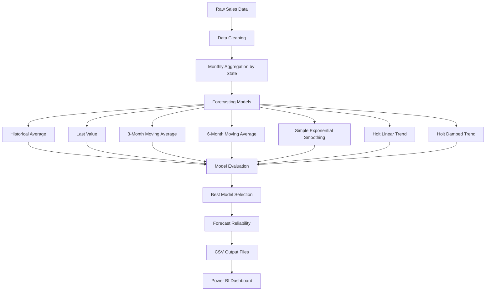
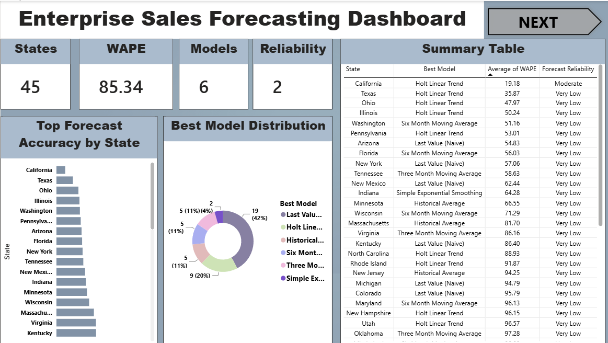
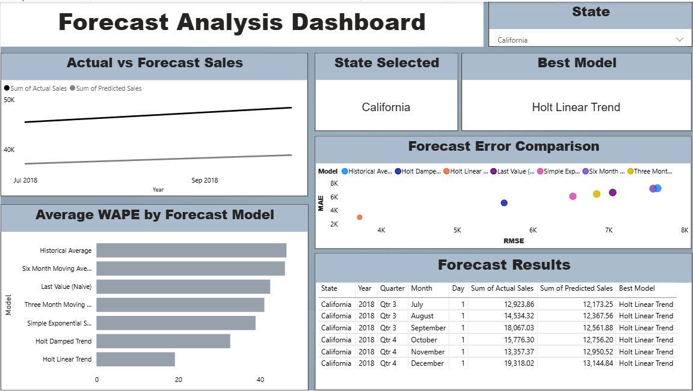

# Enterprise Sales Forecasting System

### Python • Time Series Forecasting • Power BI

A Python-based sales forecasting project that predicts future sales using historical sales data. The project benchmarks multiple time-series forecasting models, evaluates their performance using forecasting accuracy metrics, and automatically selects the best-performing forecasting model for each state.

> **Note:** This project uses only publicly available data. No confidential company data, SAP data, SQL queries, proprietary reports, or internal business information are included.

---

# Project Highlights

- Built an end-to-end sales forecasting pipeline using Python.
- Processed approximately **9,800 retail transactions** across **45 U.S. states**.
- Evaluated **7 forecasting models** for every state.
- Automatically selected the best-performing model using **WAPE**.
- Generated dashboard-ready CSV outputs.
- Built a **two-page interactive Power BI dashboard** for executive reporting and forecast analysis.

---

# Overview

This project demonstrates an end-to-end sales forecasting workflow built using Python and a publicly available retail sales dataset.

The objective is to transform raw sales transactions into reliable monthly sales forecasts using historical sales patterns.

Unlike many forecasting projects that rely on a single forecasting technique, this project compares multiple forecasting models for every state and automatically selects the model that produces the lowest forecasting error.

The final outputs are exported as CSV files and visualized through an interactive Power BI dashboard.

---

# Business Problem

Businesses operating across multiple locations require accurate sales forecasts for production planning, inventory management, procurement, budgeting, and sales planning.

Many organizations still prepare forecasts manually using spreadsheets or assumptions, making the forecasting process inconsistent across locations.

This project automates that workflow by:

- Cleaning historical sales data
- Aggregating monthly sales
- Comparing multiple forecasting models
- Selecting the most accurate model automatically
- Classifying forecast reliability
- Producing dashboard-ready outputs

The forecasts in this project are generated **only from historical sales data**. External factors such as promotions, holidays, competitor activity, weather, or economic indicators are **not included**.

---

# Project Workflow



---

# Forecasting Models

The forecasting engine evaluates seven forecasting techniques:

- Historical Average
- Last Value (Naïve)
- 3-Month Moving Average
- 6-Month Moving Average
- Simple Exponential Smoothing
- Holt Linear Trend
- Holt Damped Trend

Each state is evaluated independently because sales patterns differ across locations.

Rather than assuming one forecasting model performs best everywhere, the pipeline automatically selects the model with the lowest forecasting error for each state.

---

# Evaluation Metrics

Each forecasting model is evaluated using four forecasting metrics.

| Metric | Purpose |
|---------|----------|
| MAE | Measures average forecasting error |
| RMSE | Penalizes larger forecasting errors |
| MAPE | Percentage forecasting error |
| WAPE | Final model selection metric |

All four metrics are reported for every model.

**WAPE is used as the final model-selection metric because it enables consistent comparison across states with different sales volumes.**

---

# Forecast Reliability

Once the best forecasting model is selected, reliability is classified using WAPE.

| WAPE | Reliability |
|-------|-------------|
| <10% | High |
| 10–20% | Moderate |
| 20–30% | Low |
| >30% | Very Low |

This provides a simple business-friendly indication of forecast quality.

---

# Dataset

This project uses the **Superstore Sales Dataset** available publicly on Kaggle.

Fields used:

- Order Date
- Sales
- State
- Region
- Category

The dataset is used only to demonstrate the forecasting methodology with publicly available data.

---

# Technologies Used

- Python
- Pandas
- NumPy
- Statsmodels
- Scikit-learn
- Matplotlib
- Power BI
- Git
- GitHub

---

# Repository Structure

```text
enterprise-sales-forecasting
│
├── dashboard/
│   └── Sales Forecasting Model Project.pbix
│
├── data/
│   └── train.csv
│
├── images/
│   ├── Executive_Summary.png
│   └── Forecast_Analysis.png
│
├── output/
│   ├── Plots/
│   ├── best_model.csv
│   ├── forecast_results.csv
│   ├── model_comparison.csv
│   ├── monthly_preprocessed_data.csv
│   ├── skipped_entities.csv
│   └── state_summary.csv
│
├── src/
│   └── enterprise_sales_forecasting.py
│
├── .gitignore
├── LICENSE
├── README.md
└── requirements.txt
```
---

# Dashboard

## Executive Summary



---

## Forecast Analysis



The Power BI dashboard provides:

- Executive Summary
- Forecast vs Actual Sales
- Best Model Distribution
- Forecast Accuracy by State
- Forecast Reliability Analysis
- Model Performance Comparison
- Interactive State Filtering

---

# Results

- Successfully processed **45 eligible U.S. states**.
- Evaluated **7 forecasting models** for every state.
- Automatically selected the best-performing model using **WAPE**.
- Generated forecast outputs and model comparison reports.
- Built a two-page interactive Power BI dashboard for business reporting.

---

# Installation

Clone the repository

```bash
git clone https://github.com/your-username/enterprise-sales-forecasting.git
```

Install dependencies

```bash
pip install -r requirements.txt
```

Run the forecasting pipeline

```bash
python src/enterprise_sales_forecasting.py
```

---

## Limitations

This project forecasts sales using historical sales patterns and compares multiple time-series models. It does not incorporate external business drivers such as promotions, holidays, pricing strategies, competitor activity, or market conditions. Integrating these variables would be a valuable enhancement for improving forecast accuracy in a production environment.

---

# License

This project is licensed under the MIT License.

---

# Disclaimer

This repository has been developed using publicly available data for educational and portfolio purposes.

It does **not** contain confidential company data, SAP data, SQL queries, proprietary reports, internal dashboards, or business-sensitive information.

The forecasting methodology presented here is an independent implementation built using publicly available data.
